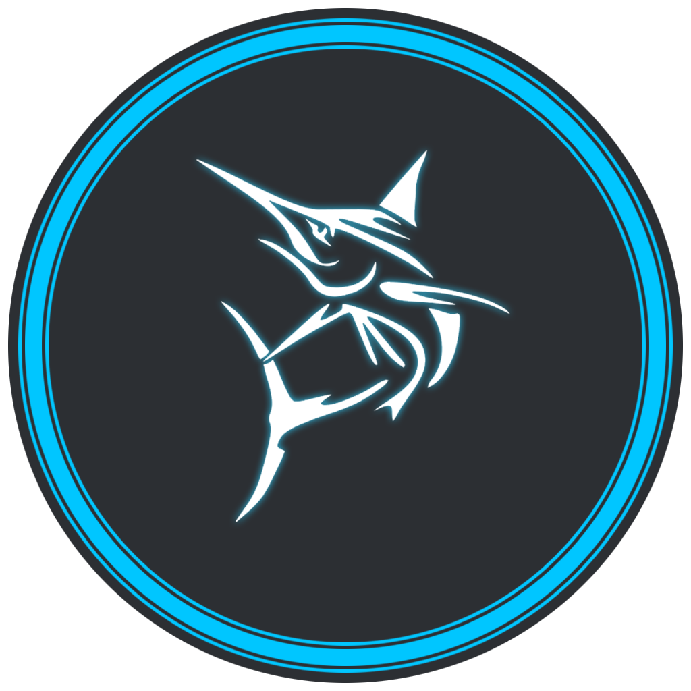

# Marlin Discord Bot!

## Tanner Morlan

*Logo Created By Me!*

*Description:*

- Marlin is a Discord bot created by Tanner Morlan. The main intention of the bot is simplicity with no hard to configure settings or permissions. The bot brings many essential features including moderation, fun commands, and essential server commands that ensure that you have exactly what you need! 

- This bot was created as a personal project, and is no longer in use.

- Since this bot was originally created, I have gotten much better at programming. Please ignore the lack of comments!

### Main Commands

- Retrieves the ping. >ping
- Retrieves the system info for the machine the bot is being run on. >sysinfo
- Retrieves the info for the server. >serverinfo
- Reports a user in a server. Anyone can use this command. >report (user) (reason)
- Gets info about yourself or a user mentioned. Leave blank if you want your own information. >whois (user)
- Sends the invite link to the bot so you can have it in your server! >botinvite
- Shows all the information related to the bot. >info
- Shows how long the bot has been running. >uptime
- Use this if you'd like to partner with a server. >partner (information about the server) 

### Moderation Commands

- Adds a role to a specified user. >addrole (user) (rolename)
- Removes a role to a specified user. >delrole (user) (rolename)
- Bans the specified user. Mention the user or use their ID. >ban (user) (reason)
- Kicks the specified user. Mention the user or use their ID. >kick (user) (reason)
- Mutes a specified member. >mute (user)
- Unmutes a specified member. >unmute (user)
- Changes the nickname of the specified user. >nick (user) (nickname)
- Clears the specified amount of messages. >clear (amount)
- Sends a message in the channel that the command was used in. >say (message)
- Same as the say command, but it creates a pretty good looking embed! >embed (message)
- Sends a custom rules command geared toward the official Marlin discord server. >rules
- Sends a custom discipline command geared toward the official Marlin discord server. >discipline
- Sends the user's avatar, leave user field blank if you want your avatar. >avatar (user)
- Sends all the roles that are in the server. >roles
- Sends the total members in the server divided into categories and the overall count. >membercount

### Fun Commands

- Sends a common meme used in discord emotes. >kek
- Sends a random picture of a cute dog. >dog
- Sends a random picture of a cute cat. >cat
- Sends a random picture of a a Shiba Inu. >shiba
- Ask the magic 8ball a question >8ball. (question)
- Wave at the bot, and it'll wave back. >wave
- Input a math equation and the bot will evaluate it. >math (input)